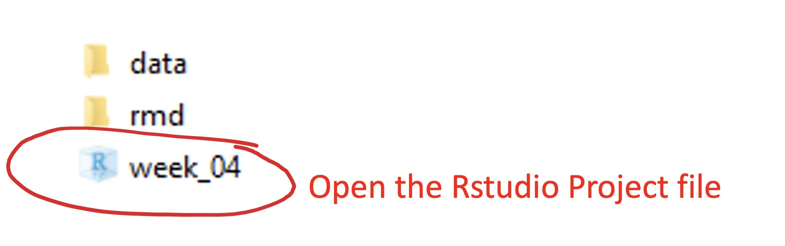
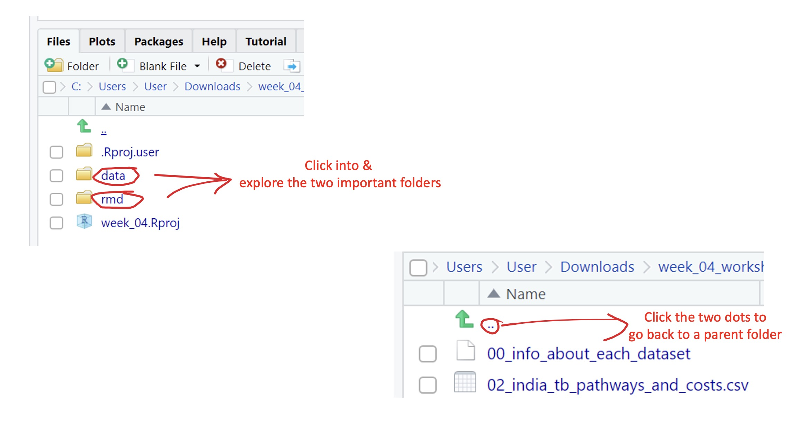

```{r include = FALSE}
# packages
if(!require(pacman)) install.packages("pacman")
pacman::p_load(tidyverse, here, patchwork, janitor, esquisse, flextable)
```

# Assignment Overview

Your task will be to create a short R Markdown-based report comparing the distribution of ANY **TWO CATEGORICAL variables** in the India TB pathways dataset. You could compare for example, education level and smoking habit, or employment and visit location, or alcohol consumption and diabetes---any two variables of your choice

**The report must contain these four things:**

a.  A plot created with {ggplot2}/{esquisse}

b.  A table created with {flextable} or another table package in R.

c.  At least one use of *inline R code* within the Rmd.

d.  At least one possible *area of improvement* mentioned.

Knit your report into a valid HTML file. When you knit your file, please turn OFF code echo on all chunks, so that you have a clean output.

To submit your work, please upload JUST YOUR Rmd to the submission page. But make sure the Rmd can be knit successfully before uploading.

# Downloading and Opening the Assignment

1.  First download the course repo by clicking on the relevant button on the assignment page.

2.  If you are on a PC, go into your downloads folder, right click on the zip file downloaded, and click on "extract all". (If you are on a Mac, you can directly click on the downloaded folder.)

    {width="477"}

3.  Then click on the RStudio Project file in the unzipped folder to open the project in RStudio. (The screenshot says "week_04", but you can ignore this. Just click on the equivalent file in your folder.)

    {width="348"}

4.  From the Files pane of RStudio, explore the "data" and "rmd" subfolders.

    {width="590"}

5.  In the "rmd" sub-folder, the instructions for your exercise are outlined (these are the same instructions you see here). There is also an example report which you can use for reference.

6.  In the "data" sub-folder, the dataset you will be working on is called "india_tb_pathways_and_costs.csv". The other dataset is for example purposes only.

# Steps to complete the assignment

1)  Open the example report Rmd and knit the document to HTML. Observe how the source code relates to the output HTML. Note how chunk options control which parts of the Rmd script are displayed in the knitted HTML, and which ones are not.

2)  Create a new Rmd file (not R script!) in the "rmd" folder. You can name it as you like.

3)   Make a new code chunk for package loading and load your needed packages. (Refer to the example report for clues about what packages you might need.) Make sure to use the correct chunk options!

4)  Under a new section heading, add a short description of the India TB dataset, similar to the one about Colombia motor accidents in the example report. Info about the dataset can be found in the "data" folder.

5)  Make a new code chunk in which you import the India TB dataset. Give the data frame a short, descriptive title. Remember to use the `here()` function when loading the CSV, otherwise, the data loading might not work.

6)  Once your dataset is loaded, inspect the dataframe and choose two categorical variables for your analysis. Once you and your group have chosen your desired variables, you can proceed with creating the four requirements for the assignment: a ggplot2 plot, a table with flextable, one use of inline R code and one possible area of improvement.

7)  Under a new section heading, describe the variables you are going to analyse. Explore data with esquisse. A good way to visualize two categorical variables is with a stacked bar chart. You can create on in esquisse by adding one variable to "X" or "Y" and the second variable to "FILL".

8)  Another way to compare the distribution of two categorical variables is with a table. You can make a frequency table using the `tabyl()` function, however this creates a data frame that is not very presentable in a report.

9)  Create a better-looking table using {flextable} or {gt}. You should summarise the SAME two variables that you chose for plotting above. Remember to use the appropriate chunk options so only the nice table is printed (see example report for hints).

10) You can highlight specific numbers from the table using square bracket notation. Remember that the object you extract numbers from should be the data frame, not the flextable or gt table.

11) Create a section called "Areas of improvement". Here you can describe some areas of your report that you would like to make better. For example, you might want to customize your plots in a specific way, but you have not yet learned the tools to do so.

12) The final and most important part- Knitting your report! Before you knit, make sure you delete or comment out any instances of `esquisser()` or `View()`. This is because functions that open new windows will interrupt the knitting process. You may have to try several times before successfully knitting your report. Be patient and ask instructors for help as you go along. Remember to delete these

------------------------------------------------------------------------

# Teacher's Live Demo of Key Topics

## Using patchwork (use of patchwork is optional)

The `patchwork` package allows you to combine multiple plots into a single plot, which can make it easier to compare plots and keep your data visualization tidy and organized.

Let's look at a simple example. Assume we have two plots called `plot1` and `plot2`:

```{r}
# load the required packages
pacman::p_load(tidyverse, patchwork)

# Create plot1
plot1 <- ggplot(mtcars, aes(x = mpg, y = hp)) +
         geom_point() 

# Create plot2
plot2 <- ggplot(mtcars, aes(x = mpg, y = disp)) +
         geom_point()

# Combine plots vertically with patchwork
combined_plot <- plot1 / plot2
combined_plot
```

In this example, the `/` operator is used to arrange the plots vertically, with `plot1` on top and `plot2` at the bottom.

If you wanted the plots to be arranged horizontally, you would use the `+` operator instead:

```{r}
# Combine plots vertically with patchwork
combined_plot_2 <- plot1 + plot2
combined_plot_2
```

## Square brackets in inline code

In R markdown, we use specific syntax to include inline R code, which is R code that runs within the text of your document. To use inline R code, we simply include the R code within backticks and precede it with an `r` like so

```{r eval = F}
We can found that there were `r your_code_here` cases in Category B.
```

One common use of inline R code is to access and display specific elements from a data object such as a matrix or dataframe. To access a specific element, we use square brackets `[]` with the row and column indices. For instance, if we have a matrix `m`, we can access the element at row 2, column 3 as follows: `m[2, 3]`.

Let's take an example with a Markdown table. Suppose we have a table as follows:

| Category | Count |
|----------|-------|
| A        | 10    |
| B        | 20    |
| C        | 30    |

If we want to display the count for Category B in our text, we could write something like this in our Rmarkdown script (not in a code chunk):

```{r eval = F}
We found that there were `r counts[2, 2]` cases in Category B.
```

When this R Markdown document is knitted, it will display as:

"We found that there were 20 cases in Category B."
