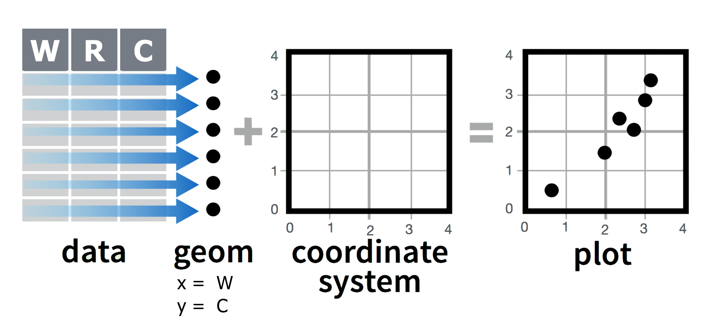

## Introduction

A **bubble plot** is a type of scatter plot where a third dimension is added: an additional numeric variable is represented by the **size** of points.

In February 2006, a Swedish physician and data advocate named Hans Rosling gave a famous TED talk titled ["The best stats you've ever seen"](https://www.ted.com/talks/hans_rosling_shows_the_best_stats_you_ve_ever_seen) where he presented global economic, health, and development data complied by the Gapminder Foundation.

The talk featured a famous bubble plot similar to this one:


Here the points display a relationship between two numeric variables on each axis, as well as a third numeric variable: the size of the bubble represents population.

We will be using Gapminder data from 2007 to create this bubble plot with `ggplot2`.

# Packages

To get started, **load in the needed packages**: {tidyverse}, {here}, and {gapminder}.

```{r}
# Load packages
"WRITE_YOUR_CODE_HERE"
```

## Gapminder data

The R package gapminder, which we just loaded, contains global economic, health, and development data complied by the Gapminder Foundation.

Run the following code to load `gapminder` data frame from the gapminder package:

```{r message = FALSE}
# Tell R to get the inbuilt dataframe from the package
data(gapminder, package="gapminder")

# Print dataframe
gapminder
```

Each row in this table corresponds to a country-year combination. For each row, we have 6 columns:

1)  **`country`**: Country name

2)  **`continent`**: Geographic region of the world

3)  **`year`**: Calendar year

4)  **`lifeExp`**: Average number of years a newborn child would live if current mortality patterns were to stay the same

5)  **`pop`**: Total population

6)  **`gdpPercap`**: Gross domestic product per person (inflation-adjusted US dollars)

The `glimpse()` and `summary()` functions can tell us more about these variables.

```{r}
# Data structure
glimpse(gapminder)
```

This version of the **`gapminder`** dataset contains information for **142 countries**, divided in to **5 continents** or world regions.

Data are recorded every 5 years from 1952 to 2007 (a total of 12 years).

```{r}
# Data summary
summary(gapminder)
```

In this lesson, we will be using the `gapminder` dataframe , but only the data from 2007.

We can use {dplyr} functions to manipulate the dataset and prepare it for plotting. Read through the commented code below to understand how and why these manipulations are done:

```{r}
# Create new data frame called gapminder07
gapminder07 <- gapminder %>%
  # filter data frame to only include rows from 2007
  "WRITE_YOUR_CODE_HERE" %>%
  # remove the year column
  "WRITE_YOUR_CODE_HERE" %>%
  # rename columns to make them easier to understand
  "WRITE_YOUR_CODE_HERE" %>% 
  # reorder dataset by population size (this will be useful for plotting later)
  "WRITE_YOUR_CODE_HERE"

# View new data subset
gapminder07
```

We will start with a regular scatter plot showing the relationship between two numerical variables, and then make it a bubble plot by adding a third dimension.

Let's say we want to view the relationship between life expectancy and GPD per capita. Create a scatter plot, with GPD on the x axis and life expectancy on the y axis:

```{r}
# Simple scatterplot
"WRITE_YOUR_CODE_HERE"
```

What you have created is a simple scatterplot by adding together the following components:

{width="482"}

Let's view this plot through the grammar of graphics:

1.  The `geom`etric objects - visual marks that represent the data - are points.
2.  The `data` variable **gdp_per_capita** gets mapped to the `x`-position `aes`thetic of the points.
3.  The `data` variable **life_expectancy** gets mapped to the `y`-position `aes`thetic of the points.

## Quick detour: Plots as objects

A `ggplot2` graph can be saved as a named R object, manipulated further, and then printed or saved.

We can use the assignment operator (`<-`) to save the plot as an object, just as we have done with data frames.

```{r}
# Save the simple scatterplot as a named object
gap_plot_base <- ggplot(
  data = gapminder07,
  mapping = aes(
    x = gdp_per_capita,
    y = life_expectancy)) +
  geom_point() 
```

This will appear in your environment, but it will **not** be printed. Unlike

To view the plot, simply type and run the name of the object:

```{r}
# Call the plot
gap_plot_base
```

Now that you have your plot as an R object, you can add new layers to it without retyping the previous code. 

For example, you can add a line of best fit to your scatter plot and save it as a new plot, without having to write the old code again:

```{r}
# Add new layer to simple scatterplot
gap_plot_base + 
  geom_smooth()

# Save new plot as object
gap_plot_02 <- "WRITE_YOUR_CODE_HERE"

# Call the new plot
"WRITE_YOUR_CODE_HERE"
```

Later in the assignment you will need to create and store plots as objects, and then further transform the plot object.

## Bubble plots with `geom_point()`

With {ggplot2}, bubble plots are built using the `geom_point()` function. At least three arguments must be provided to `aes()`: `x`, `y` and `size`.

{width="482"}

Now  add an additional variable, `population`, and map it to the size aesthetic.

```{r}
# Create bubble plot
"WRITE_YOUR_CODE_HERE"
```

Here, the population of each country is represented through point size. The legend will automatically be built by {ggplot2}, showing how point size scales with population size.

Many of the points are overlapping, so we can decrease the opacity of the points: Change the opacity of the points to 50%.

```{r}
# Decrease opacity
"WRITE_YOUR_CODE_HERE"
```

Now, let's color the bubbles by region.

```{r}
# Add color to points
"WRITE_YOUR_CODE_HERE"

# Save plot as object
gap_bubble <- "WRITE_YOUR_CODE_HERE"
```


## Modifying scales

One of the optional grammar of graphics layers that we haven't learned about yet is `scale_*()` functions.


Scales control how variables are mapped to the visual characteristics of the plot. Scale functions (which start with `scale_`) allow you to modify how mappings in `aes()` are displayed.

### Control point size with `scale_size()`

The first thing we need to improve on the previous bubble plot is the size range of the bubbles. `scale_size()` allows to set the size of the smallest and the biggest point using the `range` argument.

```{r}
gap_bubble02 <- gap_bubble +
  scale_size(range = c(1, 20))

gap_bubble02
```
Expanding the size range helps to highlight the variation in population size.

### Log transform scales

The original gapminder bubble plot we are recreating has a non-linear scale on the x-axis. This helps by spreading out the points that are clumped on the left side of the plot. 

We can address this by log-transforming the x-axis using `scale_x_log10()`, which log-scales the x-axis (as the name suggests). We will add this function as a new layer after a `+` sign, as usual:

```{r}
gap_bubble03 <- gap_bubble02 +
  "WRITE_YOUR_CODE_HERE"

gap_bubble03
```

## Themes: modifying non-data elements

### Built in ggplot themes

{ggplot2} comes with a number of built-in themes.


We can add any of these theme functions as an additional layer to change the appearance of the plot. 

```{r}
# Change theme
gap_bubble04 <- gap_bubble03 +
  "WRITE_YOUR_CODE_HERE"

gap_bubble04
```

### Removing non-data elements

The `theme()` function can be added as a layer to modify or override any non-data element of a ggplot. See the "ggplot_theme_system_cheatsheet.pdf" or the [ggoplt2 textbook](https://ggplot2-book.org/themes) for more information. 

In this plot, we may want to remove the size and continent legends, as they don't display well. 

We can do this by setting the `legend.position` argument to "none". 

```{r}
gap_bubble03 + theme(legend.position="none")
```


## Adding interactivity

Our current bubble plot doesn't show us which country each bubble is from, or what the exact population and GDP of the country is. One way to communicate this information without crowding the graph is to make it interactive. The `ggplotly()` function from the {plotly} package can convert your plot to be interactive! Look at "gap_bubble_interactive.html" in the images folder to see an example of an interactive plot that can be made with `ggplot()` and `ggplotly()`.

Your task for this section is to find out how to use this function to make your plot interactive, so that you can hover over the points to see additional information. 

```{r}
# Create interactive plot
"WRITE_YOUR_CODE_HERE"
```


## Challenge

Now it's your turn to create an animated bubble chart using the gganimate package! Familiarize yourself with the gganimate package available here: https://gganimate.com/. The front page of the website actually contains much of the code you will need.

Here are the basic steps:

1. Install and load the gganimate package.

2. Create a basic bubble chart similar to the one we made in this tutorial, but using all the gapminder data, not just 2007. Map the `gdpPercap` variable to x, `lifeExp` to y, and `pop` to size.

3. Add the animation by including `transition_time(year)` after the scatterplot layers. This will create the animation over time.

4. Render the animation and save it as a video or GIF. 

## Further Challenge

1. Customize the animation further to try to mirror the aesthetic in Hans Rosling's video [here](https://www.youtube.com/watch?v=jbkSRLYSojo ): 

- Make the plot/panel background dark.

- Add a large indicator for the year at the bottom right of the plot, 

- Adjust the GDP and life expectancy scale markers to closely mirror those in the video (25, 50 75 years; 400 4000, 40000 USD).

- Add continent coloring that mirrors those in the video

We have not covered many of these , but see if you can piece together the steps by reading the documentation for gganimate, asking GPT-4 for help, and searching online with Bing.
