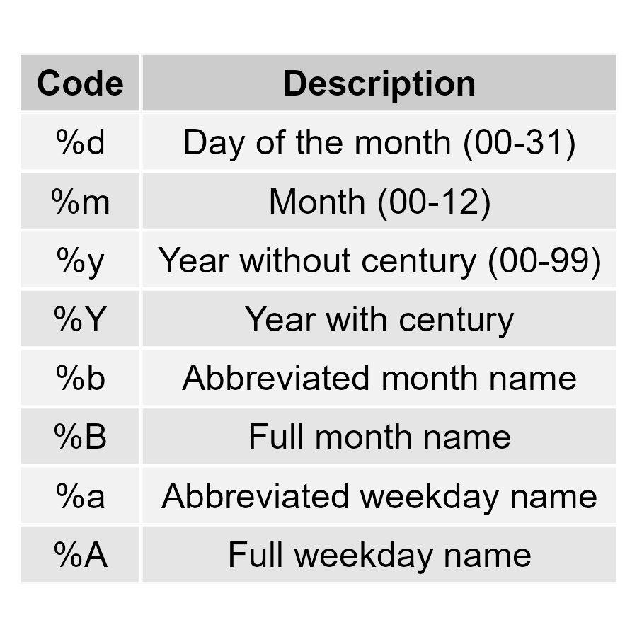

# Packages

```{r}
pacman::p_load(tidyverse, here)
```

# Data: Childhood diarrheal diseases in Mali

We will use the `malidd` data frame, which we've seen in previous lessons.

```{r message=F}
# Load data from CSV
malidd <- read_csv(here::here("data/malidd.csv"))

# Inspect dataframe
malidd %>% head()
```

```{r}
# Look at data classes of each variable
glimpse(malidd)
```

Note that `read_csv()` (a dplyr function) has recognized the `admit_date` column from our CSV as a variable of class "date". If we used `read.csv()` (a base R function) would read it as class "character". This is one example of how tidyverse functions are more intuitive than base R.

```{r}
summary(malidd)
```

Notice that there lots of numeric variables that could be visualized with histograms. We also have a date variable that could be used for a time series line graph.

# Time series plot with `geom_line()`

Let's create a line graph to look at the number of admissions per day - the `admit_date` variable - over time.

## Basic time series line graph with summarized data

Create a time series plot by first summarizing the data to count the number of admissions for each day in `admit_date`, then plot the summary data using `geom_line()`.

```{r}
# Grop and summarize data to get the total number of admissions per date
"WRITE YOUR CODE HERE"
```

You should now have a summary data frame with 31 observations of 2 variables.

Make a line plot using the summary table you created above.

```{r}
# Plot dates on the x-axis and count on the y-axis
"WRITE YOUR CODE HERE"
```

Use the `labs()` function to add a title, subtitle, and appropriate x and y axis titles.

```{r}
# Plot dates on the x-axis and count on the y-axis
"WRITE YOUR CODE HERE"
```

## Customizing x-axis tick labels with `scale_x_date()`

When you use variables of class "date" in `aes()`, the default tick labels on the axis may not be ideal. You can customize x-axis tick labels of the previous plot using `scale_x_date()`.

We can customize the frequency of date labels, just like we did with `scale_x_continuous()` in the prework. While `scale_x_continuous()` uses the `breaks` argument to specify a sequence of numbers, `scale_x_date()` uses an argument called `date_breaks`:

```{r}
# Example of scaling date axis using date_breaks
ggplot(malidd, aes(x = admit_date)) +
  geom_line(stat = "count") +
  scale_x_date(date_breaks = "3 months")
```

This gives us a label every 3 months, instead of every 2 months like we had before. However, the date labels are now in YYYY-MM-DD format. We can customize how the dates are formatted, using the `date_labels` argument:

```{r}
# Example of formatting date labels using date_labels
ggplot(malidd, aes(x = admit_date)) +
  geom_line(stat = "count") +
  scale_x_date(date_breaks = "2 months", 
               date_labels = "%B")
```

You may be wondering what `"%B"` means. When customizing date formats in {ggplot2}, we use specific codes to represent various components of a date.

Here are some common codes that you can give to `date_labels`:



Change the axis ticks labels on the previous line graph to display abbreviated month names every 1 month.

```{r}
"WRITE YOUR CODE HERE"
```

Further customize your plot to add color, labels, themes, and a layer of points. Adjust the size, shape, and transparency of points as you wish.

```{r}
# Line graph with custom aesthetics
"WRITE YOUR CODE HERE"
```

Bonus: You can also add a *themes* layer to your plot, using one the built-in `theme_*` functions in {ggplot2}, such as `theme_bw()`, `theme_minimal()`, or `theme_light()`. There are several more!

```{r}
# Try adding different theme functions and pick your favorite
"WRITE YOUR CODE HERE"
```

# Comparing distributions with position adjustments

Here's a histogram looking at the distribution of a numerical variable, `muac_cm`. MUAC stands for middle-upper arm circumference, and is measured in centimeters.

```{r}
# Example simple histogram
ggplot(data =  malidd , 
       mapping = aes(x = muac_cm)) +
  geom_histogram()
```

Build on this code to draw histogram of MUAC with black outline, white fill, and bin width of 0.5.

```{r}
"WRITE YOUR CODE HERE"
```

Now say we want to split each bar of the histogram by categorical variables in `malidd`, like `sex`.

Plot a simple stacked histogram of MUAC and set the `fill` parameter to sex.

```{r}
"WRITE YOUR CODE HERE"
```

### Position adjustments

After setting fill color, you can change the position adjustment within `geom_histogram()`.

Possible values for the argument **position** in `geom_histogram()` are `“identity”`, `“stack”`, `“dodge”`. Default value is `“stack”`.

Setting position to `“stack”` will give you the same plot as above.

```{r}
# stack: stacked distributions of a categorical variable  
ggplot(data =  malidd , 
       mapping = aes(x = muac_cm, 
                     fill = sex,
                     color = sex)) +
  geom_histogram(alpha = 0.4, 
                 position = "stack") + 
  ggtitle("position = 'stack'")
```

Use the `position` argument in `geom_histogram()` to create the following:

-   Histogram of height with overlapping bars

```{r}
# identity: draw overlapping distributions on the same plot

"WRITE YOUR CODE HERE"
```

-   Histogram of weight with dodged bars

```{r}
# dodge: interweave distributions on the same plot

"WRITE YOUR CODE HERE"
```

## Position adjustments for age groups

Now we will apply position adjustments with a new categorical variable.

We'll first create a new categorical variable called **`age_group`**.

```{r}
# Create new variable with 3 age groups
malidd <- malidd %>% 
  mutate(age_group = case_when(
    age_months <= 3 ~ 'newborn',
    age_months > 3 & age_months <= 12 ~ 'infant',
    age_months > 12 & age_months <= 48 ~ 'toddler'))
```

Use {dplyr} functions to change `age_group` to factor, and relevel the factor to go from youngest age group to oldest age group.

```{r}
# Mutate to factor and reorder levels
"WRITE YOUR CODE HERE"
```

Set `fill` to age group, and compare distributions between age groups using `position` arguments. You can use any numeric variables from the `malidd` data frame as the `x` aesthetic for your histogram.

Try to come up with 3 different histograms.

```{r}
# Plot 1
"WRITE YOUR CODE HERE"
```

```{r}
# Plot 2
"WRITE YOUR CODE HERE"
```

```{r}
# Plot 3
"WRITE YOUR CODE HERE"
```

# Bonus challenge: Color Scale functions

Did you know that `scale_*()` functions are also used to customize the color palettes of {ggplot2} graphs?

Do some research on the {paletteer} package, and how it interfaces with `scale_*()` functions in {ggplot2}.

Here are some palettes to explore:

-   <https://rpubs.com/kenwosu/653735>

-   <https://emilhvitfeldt.github.io/paletteer/index.html>
