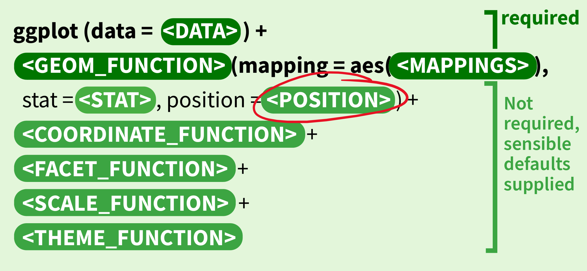

# Packages

```{r}
pacman::p_load(tidyverse, here)
```

# Data: Childhood diarrheal diseases in Mali

We will use the `malidd` data frame, which we've seen in previous lessons.

```{r message=F}
# Load data from CSV
malidd <- read_csv(here::here("data/malidd.csv"))

# Inspect dataframe
malidd %>% head()
```

```{r}
# Look at data classes of each variable
glimpse(malidd)
```

Note that `read_csv()` from {dplyr} has recognized the `admit_date` column from our CSV as a variable of class "date". This is crucial for plotting dates. If we used `read.csv()` (a base R function) would read it as class "character", and we would need to mutate it with `as.Date()`. This is one example of how {tidyverse} functions are more intuitive than base R, and why we use `read_csv()` and `write_csv()` instead of `read.csv()` and `write.csv()`.

```{r}
summary(malidd)
```

Notice that there lots of **continuous** numeric variables that could be visualized with a histogram. We also have a **date** variable that will be used as the x-position aesthetic for a time series line graph.

# Time series plot with `geom_line()`

Let's create a line graph to look at the number of admissions per day - the `admit_date` variable - over time.

## Basic time series line graph with summarized data

To create a time series plot of number of admissions per day, we can start by:

1.  Summarizing the data to count the number of admissions for each day in `admit_date`, then

2.  Plotting the summary data using `geom_line()`.

**Step 1: Calculate x and y variables**

```{r}
# Wrangle malidd to calculate the total number of admissions per date
admits_per_day <- "WRITE YOUR CODE HERE"

# HINT: You can use `group_by()` and `summarize()` OR `count()`.
```

You should now have a summary data frame called `admits_per_day` with 31 observations of 2 variables.

**Step 2: Create time series plot**

Make a line plot using the summary table you created above.

```{r}
# Plot dates on the x-axis and count on the y-axis
"WRITE YOUR CODE HERE"
```

Use the `labs()` function to add a title, subtitle, and appropriate x and y axis titles.

```{r}
# Add labels
"WRITE YOUR CODE HERE"
```

**Pro tip: `stat = "count"`** **for plotting in one step**

An alternative to the 2-step process is using the `stat = "count"` argument in `geom_line()`. This feature of {ggplot2} allows us to avoid manual data summarization by automatically calculating number of admissions for each date from the original `malidd` data frame.

```{r}
# Example of how to create a line plot using stat = "count"
ggplot(
  # use original data frame
  data = malidd,
  # remove y-axis aes which is usually required for geom_line()
  mapping = aes(x = admit_date)) +
  # add stat argument to geom_*() function
  geom_line(stat = "count")
```

You can also use `stat = "count"` in `geom_point()`. Build on the code above by adding a new layer of points using this method.

```{r}
"WRITE YOUR CODE HERE"
ggplot(data = malidd,
       mapping = aes(x = admit_date)) +
  geom_line(stat = "count") +
  geom_point(stat = "count")
```

## Customizing x-axis tick labels with `scale_x_date()`

When you use variables of class "date" in `aes()`, the default spacing of tick labels on the axis may not be ideal. In the case above, the x-axis adds a month name every 3 months.

You can customize the frequency of x-axis tick labels using a {ggplot2} function called **`scale_x_date()`** (or `scale_y_date()` for y-axis).

We can customize the frequency of date labels, just like we did with `scale_x_continuous()` in the pre-work lesson. While `scale_x_continuous()` uses the `breaks` argument to specify a sequence of numbers, `scale_x_date()` uses an argument called **`date_breaks`**, like so:

```{r}
# Example of scaling date axis using date_breaks in scale_x_date()
ggplot(malidd, aes(x = admit_date)) +
  geom_line(stat = "count") +
  # add a new scales layer
  scale_x_date(date_breaks = "2 months")
```

This added x-axis labels every 2 months, instead of the 3 month intervals we had before. However, the date labels are now in YYYY-MM-DD format.

We can customize how the dates are formatted, using the `date_labels` argument:

```{r}
# Example of formatting date labels using date_labels
ggplot(malidd, aes(x = admit_date)) +
  geom_line(stat = "count") +
  scale_x_date(date_breaks = "2 months", 
               date_labels = "%B") # see detailed explanation below
```

You may be wondering what `"%B"` means. When customizing date formats in {ggplot2}, we use specific codes to represent various components of a date.

Here are some common codes that you can give to `date_labels`:


Change the axis ticks labels on the previous line graph to display **abbreviated month names** every **1 month**.

```{r}
"WRITE YOUR CODE HERE"
```

Further customize your plot to add **color**, **labels**, and a layer of **points**. Adjust the size, shape, and transparency of points as you wish.

```{r}
# Line graph + scatterplot with customization
"WRITE YOUR CODE HERE"
```

Bonus: You can also add a *themes* layer to your plot, using one the built-in `theme_*` functions in {ggplot2}, such as `theme_bw()`, `theme_minimal()`, or `theme_light()`. There are several more!

```{r}
# Try adding different theme functions and pick your favorite
"WRITE YOUR CODE HERE"
```

# Comparing distributions with position adjustments

Here's a **histogram** looking at the distribution of a numerical variable, **`muac_cm`**. MUAC stands for middle-upper arm circumference, and is measured in centimeters.

```{r}
# Example simple histogram of children's MUAC
ggplot(data =  malidd , 
       mapping = aes(x = muac_cm)) +
  geom_histogram()
```

Build on this code to draw histogram of MUAC with black outline, white fill, and bin width of 0.5.

```{r}
# Customize MUAC historgram (feel free to use other colors if desired)
"WRITE YOUR CODE HERE"
```

Now say we want to understand if there's a difference in size between male and female children. We can visualize this with a **stacked histogram** - this means we split each bar into **2 colors**, one for each sex.

Plot a stacked histogram of `muac_cm` colored by the `sex` variable in `malidd`.

```{r}
# Set the fill aesthetic to sex.
"WRITE YOUR CODE HERE"

# WATCH OUT: make sure you are adding fill to the correct place in your ggplot code. Think about the difference between a fixed aesthetic and a mapping aesthetic.
```

### Position adjustments

After setting fill color, you can change the position adjustment within `geom_histogram()`.

{width="617"}

Possible values for the argument **position** in `geom_histogram()` are `“identity”`, `“stack”`, `“dodge”`. Default value is `“stack”`.

Setting position to `“stack”` will give you the same plot as above.

```{r}
# position stack: stacked distributions of a categorical variable  
ggplot(data =  malidd , 
       mapping = aes(x = muac_cm, 
                     fill = sex,
                     color = sex)) +
  geom_histogram(alpha = 0.4, 
                 position = "stack") + 
  ggtitle("position = 'stack'")
```

Use the `position` argument in `geom_histogram()` to create the following:

-   Histogram of *height* with overlapping bars

```{r}
# position identity: draw overlapping distributions on the same plot

"WRITE YOUR CODE HERE"

# BONUS TIP: Replace `geom_histogram()` with `geom_density()` for a nicer looking plot.
```

-   Histogram of *body temperature* with dodged bars

```{r}
# position dodge: interweave distributions on the same plot

"WRITE YOUR CODE HERE"
```

## Position adjustments for age groups

Now we will apply position adjustments with a new categorical variable.

We'll first create a categorical variable called **`age_group`**.

```{r}
# Create new variable with 3 age groups
malidd <- malidd %>% 
  mutate(age_group = case_when(
    age_months <= 3 ~ 'newborn',
    age_months > 3 & age_months <= 12 ~ 'infant',
    age_months > 12 & age_months <= 48 ~ 'toddler'))
```

The newly added variable is of class "character".

```{r}
# Check class
malidd$age_group %>% class()
```

Use the correct {dplyr} functions to change the `age_group` to **factor**, and edit the **`levels`** of the factor to go from youngest age group to oldest age group.

```{r}
# Mutate to factor and reorder levels
"WRITE YOUR CODE HERE"
```

Now you can create histograms to compare newborns, infants, and toddlers.

Set `fill` to `age_group` and `x` to a continuous variable from `malidd`, such as `height`, `temp`, `freqrespi`, etc. Use different `position` arguments for stacked, dodged, or overlapping bars.

Try to come up with 3 different histograms.

```{r}
# Plot 1
"WRITE YOUR CODE HERE"
```

```{r}
# Plot 2
"WRITE YOUR CODE HERE"
```

```{r}
# Plot 3
"WRITE YOUR CODE HERE"
```

# Bonus challenge: Color Scale functions

Did you know that `scale_*()` functions are also used to customize the color palettes of {ggplot2} graphs?

One package with beautiful color palettes is {paletteer}.

```{r}
# Install and load paletteer

```

Do some online research on the how {paletteer} works, and how it interfaces with `scale_*_()` functions in {ggplot2}.

Here are some links to explore:

-   [{paletteer} package documentation](https://emilhvitfeldt.github.io/paletteer/index.html). See the section on {ggplot2} scales for example code using the `scale_color_paletteer_d()` function. Apply this function to your age group histograms, and try different palettes.

-   There are a large number of palette names that you can use with `scale_color_paletteer_d()` or `scale_fill_paletteer_d()`. We have visualized them [here](), so that you can browse though the colors and choose palettes that look nice to you :)
